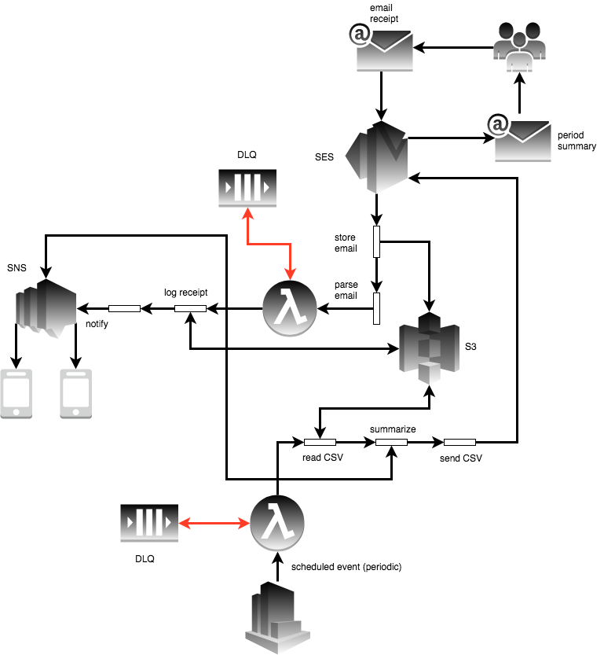

# serverless-budget

> Automated budget tracking


## Why

I got tired of saving receipts and manually updating a spreadsheet, and I didn't like the mobile interface for Google Sheets. We also found other personal finance apps to be too complex or inaccurate.

I think this approach is a bit simpler, as now I can

* send a simple receipt email to commit an update
* be notified and notify others when money is spent
* have the budget reset periodically week and be notified of results


## Design

<p align="center">
  
</p>

Two CSV files live in S3, a template budget file, and the active budget, which is a copy of the template, but partially filled.


Emails (essentially receipts) to a domain registered via Route53 trigger a Lambda that then updates the file on S3 and sends an SMS notification.

Using S3 as a data store isn't concurrency-safe, but traffic is low and spread far apart. Also, we don't need to persist the data for more than a given period (currently one week).

Periodically (currently every Monday at 7AM PST) the budget is reset and a summary notification is sent via SMS.


## Getting started

Make sure your AWS credentials are configured. The code assumes the existence of a `yangmillstheory` IAM user, so:

```
🤔 ~/c/budget (9cb6bd9)|master⚡
± [i]: cat ~/.aws/credentials
[yangmillstheory]
aws_access_key_id = <snip>
aws_secret_access_key = <snip>
```

Install `terraform`:

```
$ brew install terraform  # or brew upgrade terraform if you have it
$ terraform init          # have to do this in the core modules as well
```

Need an email address to send email receipts to:

```
$ export TF_VAR_budget_email=
$ export TF_VAR_allowed_senders= # comma-separated email addresses
```

## Development

### AWS

```
$ terraform plan
$ terraform apply # writes state to S3
```

### Lambda


Test the email receiver.

```
$ ./scripts/test-receive.sh
```

Test budget reset, which is invoked periodically by a CloudWatch event rule.

```
$ ./scripts/test-budget-reset.sh
```

### Checking results

Dump the current budget to stdout:

```
$ ./scripts/cat-budget.sh
```

Open the file (uses Excel if you have it):

```
$ ./scripts/open-budget.sh
```
